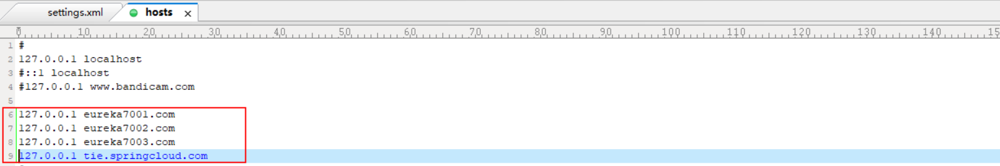
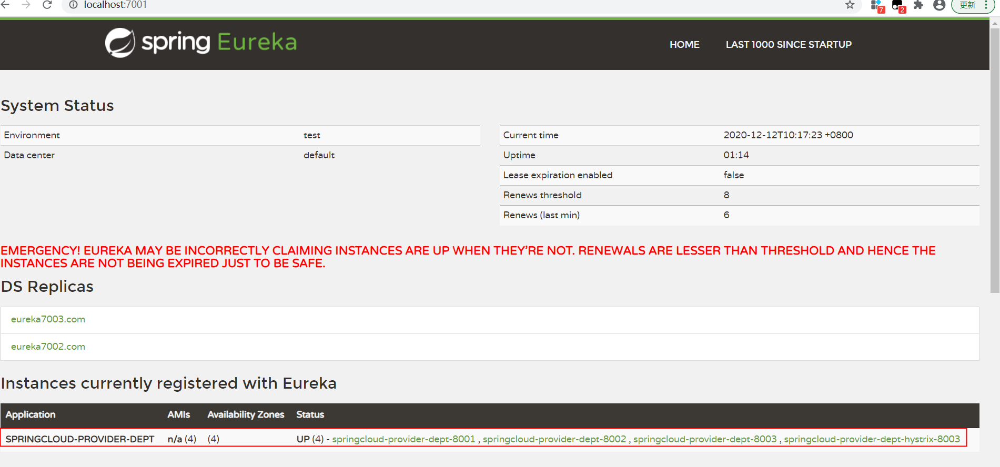
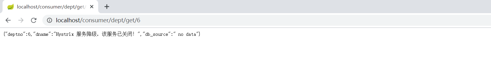
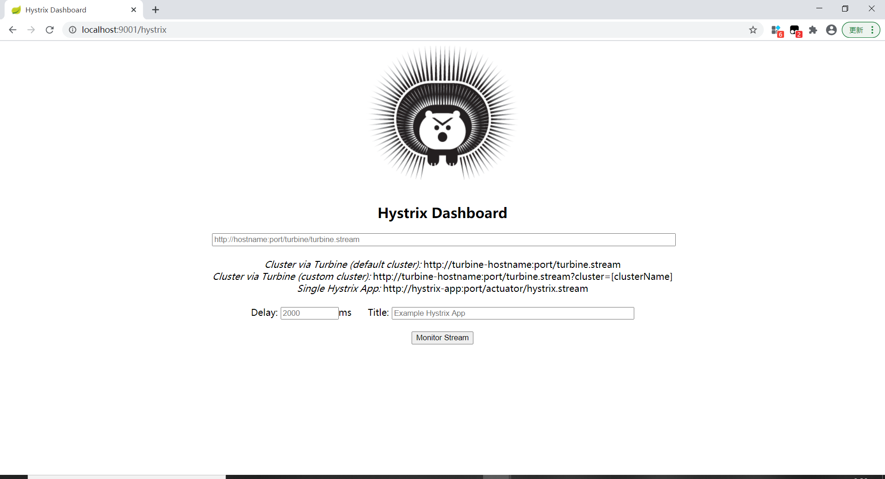
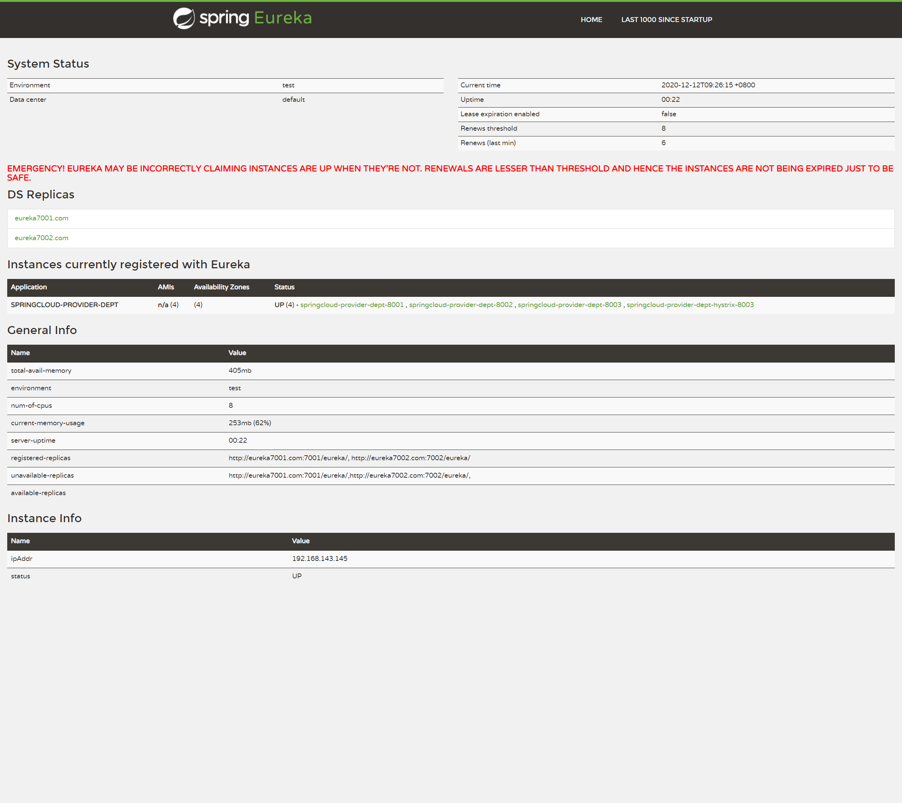
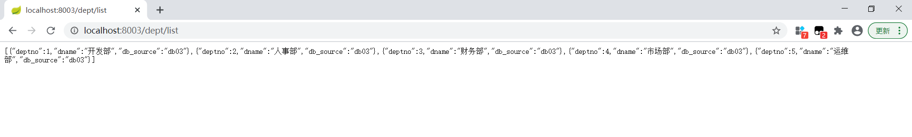
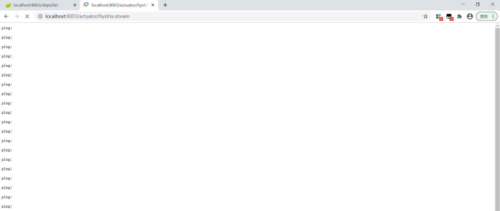
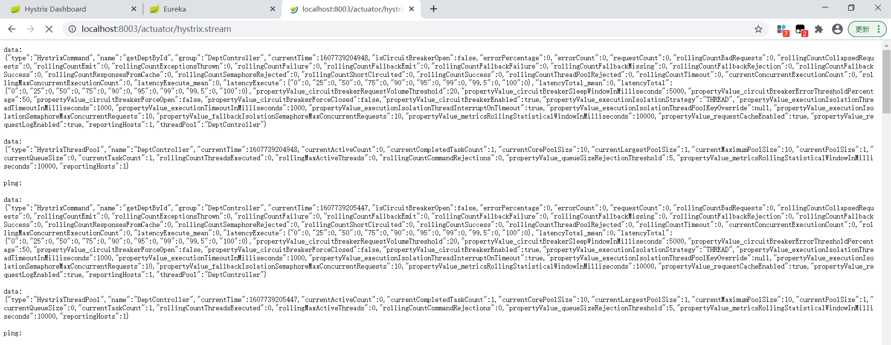
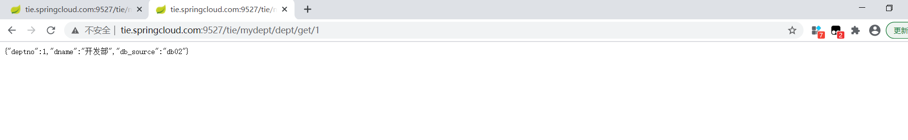
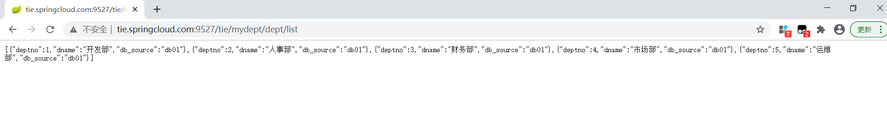

#   spring 国内脚手架  定制版 Spring Initializr : https://start.aliyun.com/

#   修改maven镜像  ：在 setting.xml中添加一下信息
        <localRepository>D:\MySoft\apache-maven-tie\respository</localRepository>
        <mirror>
            <id>alimaven</id>
            <name>aliyun maven</name>
            <url>https://maven.aliyun.com/nexus/content/groups/public/</url>
            <mirrorOf>central</mirrorOf>
        </mirror>

#一、在springcloud的pom.xml中添加父依赖
        注意：Spring Cloud和Spring Boot的版本匹配

        Table 1. Release train Spring Boot compatibility
        
        SpringCloud Release 	Boot Version
        Hoxton                      2.2.x       
        Greenwich                   2.1.x        
        Finchley                    2.0.x      
        Edgware                     1.5.x     
        Dalston                     1.5.x
        
        2、log4j有冲突问题

#二、springcloud-api

## 1、在springcloud-api的pom.xml中引入需要的依赖
## 2、连接数据库
## 3、编写dept实体类  
     注意 3.1：必须实现序列化

#三、springcloud-provider-dept-8001
## 1、导入实体类和其他依赖：在pom中配置api module
## 2、配置application.yaml 和 mybatis-config.xml
     注意：   2.1  serverTimezone=Asia/Shanghai 必须写
             2.2  username  和 password 要写对
## 3、编写DeptDao和DeptMapper
## 4、编写 DeptServiceImpl 
## 5、编写DeptController 测试 http://localhost:8001/dept/list

# 四：springcloud-consumer-dept-80
## 1、导入实体类和依赖：在pom中配置api module
        注意： 1.5版本使用spring-cloud-starter-eureka-server还是没问题的。2.0以上建议使用 spring-cloud-starter-netflix-eureka-server
        https://www.cnblogs.com/zhoading/p/12174565.html
## 2、配置application.yaml 
## 3、编写DeptConsumerController，  通过调用 ConfigBean 中的 RestTemplate，实现访问远程http服务

# 五：服务注册-信息配置
## 1、在springcloud-provider-dept-8001 导入 spring-cloud-starter-eureka 包
## 2、在springcloud-provider-dept-8001工程的yaml文件中配置eureka
## 3、在DeptProvider_8001启动类中加EnableEurekaClient注解
## 4、重启eureka_7001和provider
    http://localhost:7001/   发现springcloud-provider-dept已注册到eureka
    Instances currently registered with Eureka
    Application	AMIs	Availability Zones	Status
    SPRINGCLOUD-PROVIDER-DEPT	n/a (1)	(1)	UP (1) - DESKTOP-IOAIPM5:springcloud-provider-dept:8001
## 5、获取微服务信息
    5.1 DeptController 添加 discovery 方法
    5.2 DeptProvider_8001 启动类中开启 @EnableDiscoveryClient  注解

# 六：配置rureka集群
## 1、导包
## 2、修改配置
## 3、主启动类
## 4、 C:\Windows\System32\drivers\etc\hosts里添加
        127.0.0.1 eureka7001.com
        127.0.0.1 eureka7002.com
        127.0.0.1 eureka7003.com

## 5、修改把eureka配置

      5.1 hostname分别改成 eureka7001.com、eureka7002.com、eureka7003.com
      5.2 修改defaultZone
## 6、把provider注册到集群
     把springcloud-provider-dept-8001的yaml文件中eureka的defaultZone 改成集群
## 7、启动集群 登录
    http://eureka7001.com:7001/  或 http://localhost:7001/
    http://eureka7002.com:7002/  或 http://localhost:7002/
    http://eureka7003.com:7003/  或 http://localhost:7003/
    会发现springcloud-provider-dept-8001 已经注册到了 3个服务上

# 8、Eureka和Zookeeper对比：

    著名的CAP理论指出，一个分布式系统不可能同时满足C（一致性）、A（可用性）和P（分区容错性）。
    由于分区容错性P是分布式系统中必须保证的，因此我们只能在A和C中间进行权衡。
    
    Zookeeper保证的是CP（一致性和分区容错性）
    Eureka保证的是AP（可用性和分区容错性）

## 9、负载均衡 Ribbon
### 9.1 在 springcloud-consumer-dept-80 中添加Ribbon 和Eureeka 依赖
### 9.2 修改yaml配置文件
        添加eureka配置  ，在主启动类中添加注解@EnableEurekaClient
### 9.3 在ConfigBean的中getRestTemplate上添加@LoadBalanced注解
### 9.4 修改DeptConsumerController下的服务访问路径REST_URI_PREFIX
### 9.5 启动Eureka集群、provider、consumer，

### 	  访问 http://localhost/consumer/dept/list

## 10、新增数据库和服务测试集群
### 10.1 新建数据库db02，db03 ，ideal的database中添加db02，db03
### 10.2 复制2个服务springcloud-provider-dept-8002，springcloud-provider-dept-8003
        1：复制pom
        2：application.yaml 修改端口、数据库和 instance-id
        3：复制mybatis包 注意：DeptMapper.xml中的类要去掉数据库名  （select * from db01.dept; 改成 select * from dept;）
        4：复制com.tie.springcloud包 修改主启动类
### 测试 http://localhost/consumer/dept/list  会发现数据库轮询切换

## 11、负载均衡 Feign （面向接口）
### 11.1 创建springcloud-consumer-dept-feign（复制 springcloud-consumer-dept-80工程）
### 11.2 在 springcloud-consumer-dept-feign工程和 springcloud-api 工程pom中添加feign依赖
### 11.3 在springcloud-api 中添加 接口DeptService
### 11.4 在 springcloud-consumer-dept-feign 的 DeptConsumerController中注入DeptService,用DeptService重新实现方法
### 11.5 在 springcloud-consumer-dept-feign 主启动类中添加注解EnableFeignClients，启动测试

## 12、Hystrix 服务熔断 ： 服务端
### 12.1 创建springcloud-provider-dept-hystrix-8003 --复制 springcloud-provider-dept-8003 
### 12.2 添加Hystrix依赖
### 12.3 修改主启动类类名 ，yaml中修改 instance-id: springcloud-provider-dept-hystrix-8003
### 12.4 DeptController中添加getDeptById的异常处理方法的熔断处理方法throw new Exception
### 12.5 DeptController中添加熔断方法hystrixGetDeptById，在getDeptById上添加熔断注解 @HystrixCommand(fallbackMethod = "hystrixGetDeptById")
### 12.6 主启动类添加注解@EnableCircuitBreaker   
### 12.7 测试 http://localhost/consumer/dept/get/6 
        提示 ： {"deptno":6,"dname":"no exists this Dept --->hystrix","db_source":"no this DATABASE in MYSQL"}

###  12.8 其他：

    eureka. instance . prefer-ip-address: true  #true  可以显示服务的IP地址        

## 13、Hystrix 服务降级 ： 客户端 
### 13.1 在springcloud-api 编写服务降级类 DeptClientServiceFallbackFactory
### 13.1 在springcloud-api 的DeptClientService 接口上添加 注解 fallbackFactory = DeptClientServiceFallbackFactory.class
### 13.3 在springcloud-consumer-dept-feign 工程 的yaml中开启Feign 服务降级
         feign:
           hystrix:
             enabled: true
### 13.4 测试 http://localhost/consumer/dept/get/6 
         启动集群，一个provider 和 FeignDeptConsumer 可以正常查询
         关闭provider后 会返回用户信息{"deptno":3,"dname":"Hystrix 服务降级，该服务已关闭！","db_source":" no data"}

### 13.5 服务熔断和服务降级的区别    

        https://www.jianshu.com/p/6f5b1095d749  

​            
## 14 Hystrix -dashboard 监控信息     
### 14.1 创建springcloud-consumer-hystrix-dashboard 工程 （）
### 14.2 pom中导入 springcloud-consumer-dept-80 相同的依赖 
### 14.3 pom中添加hystrix-dashboard 依赖 
        <dependency>
            <groupId>org.springframework.cloud</groupId>
            <artifactId>spring-cloud-starter-hystrix-dashboard</artifactId>
            <version>1.4.7.RELEASE</version>
        </dependency>
### 14.4 配置yaml ： server.port :9001
### 14.5 编写主启动类 
#### 14.5.1 添加注解@EnableHystrixDashboard //开启dashboard监控  
        注意： 确认8001-8003 provider服务中有 actuator完善监控信息包-->
#### 14.5.2 编写ServletRegistrationBean

### 14.6  启动服务 测试
        1、http://localhost:9001/hystrix 查看监控界面能否打开   
        2、http://eureka7003.com:7003/  查看eureka是否访问
        3、http://localhost:8003/dept/list 查看服务是否正常访问数据    
        4、http://localhost:8003/actuator/hystrix.stream 查看查询的时候是否有ping的信息  
        5、在 1 的界面 添加 4 的监控路劲，Delay和Title 可以自定义 ，点击Monitor Stream 查看监控信息 
        error： com.sun.jersey.api.client.ClientHandlerException: java.net.ConnectException: Connection refused: connect
                dashboard没有监控的服务，把 1的界面信息添上进入监控页面就OK

​		 1、http://localhost:9001/hystrix

​			2、http://eureka7003.com:7003/

 

​				3、http://localhost:8003/dept/list 

 
			4、http://localhost:8003/actuator/hystrix.stream 

​		客户端访问数据

## 15 zuul 网关

### 15.1 新建 springcloud-zuul-9527 工程 ，
### 15.2 添加dashboard中的依赖，导入zuul依赖
        <dependency>
            <groupId>org.springframework.cloud</groupId>
            <artifactId>spring-cloud-starter-zuul</artifactId>
            <version>1.4.7.RELEASE</version>
        </dependency>
### 15.3 添加yaml文件 ，在C:\Windows\System32\drivers\etc\hosts中添加127.0.0.1 127.0.0.1 tie.springcloud.com
### 15.4 编写主启动类，添加注解@EnableZuulProxy
        http://eureka7003.com:7003/
        http://localhost:8003/dept/list

​      
        zuul:
          routes:
            mydept.serviceId: springcloud-provider-dept # http://tie.springcloud.com:9527/springcloud-provider-dept/dept/list
            mydept.path: /mydept/**  # http://tie.springcloud.com:9527/springcloud-provider-dept/mydept/dept/list
        #  ignored-services: springcloud-provider-dept  # 隐藏某个服务路径
          ignored-services: "*" #所有路径都屏蔽，都必须走网关
          prefix: /tie # 设置公共的前缀   

  	访问 http://tie.springcloud.com:9527/tie/mydept/dept/get/1

​		访问http://tie.springcloud.com:9527/tie/mydept/dept/list

# 总结

###    1、3个集群
        springcloud-eureka-7001                         http://eureka7001.com:7001/  
        springcloud-eureka-7002                         http://eureka7002.com:7002/
        springcloud-eureka-7003                         http://eureka7003.com:7003/      
###    2、4个服务端服务
        springcloud-provider-dept-8001                  http://localhost:8001/dept/list
        springcloud-provider-dept-8002                  http://localhost:8002/dept/list
        springcloud-provider-dept-8003                  http://localhost:8003/dept/list
        springcloud-provider-dept-hystrix-8003(服务熔断) http://localhost:8003/dept/list
            服务熔断提示： {"deptno":57,"dname":"no exists this Dept --->hystrix","db_source":"no this DATABASE in MYSQL"}
###    3、2个客户端服务
        springcloud-consumer-dept-80                    http://localhost/consumer/dept/get/5    
        springcloud-consumer-dept-feign(服务降级)        http://localhost/consumer/dept/get/5   
            服务降级提示： {"deptno":3,"dname":"Hystrix 服务降级，该服务已关闭！","db_source":" no data"}           
###    4、1个网关服务
       springcloud-zuul-9527                            http://tie.springcloud.com:9527/tie/mydept/dept/list
!

###    5、1个监控服务

       springcloud-consumer-hystrix-dashboard           http://localhost:8003/actuator/hystrix.stream 

​        
Others:
​    导入依赖的时候让ideal能都自动提示设置：
​        在setting-->Build  ,Execution,Deployment-->Build Tool -->
​                Maven --> repository 选择自己的maven ，Update ，Apply -OK

